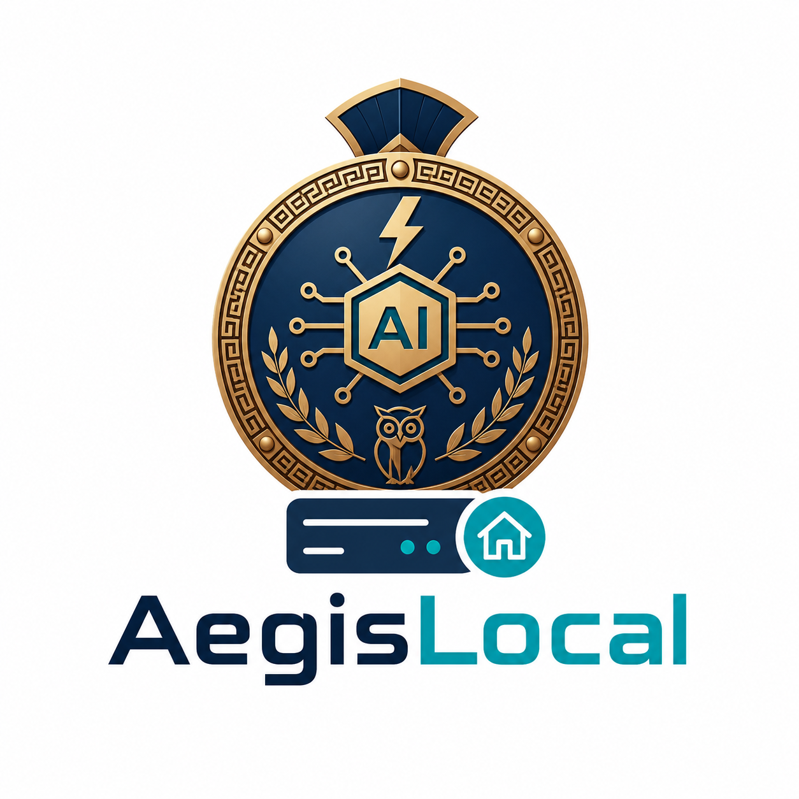

<p align="center">
  
</p>

<h1 align="center">AegisLocal</h1>
AegisLocal is a local-first security scanner for AI applications and local LLM
deployments. It audits both dependency risk and model behavior from a single CLI
command, then emits a structured JSON report that works well for local
development and CI.

The scanner is intentionally lightweight: it uses HTTP APIs for model access and
does not import heavyweight ML frameworks such as `torch`, `transformers`, or
`langchain`.

## Key Features

- **Static dependency scanning** for recursively discovered Python dependency
  manifests.
- **OSV vulnerability lookups** for pinned Python dependencies.
- **Dynamic LLM fuzzing** with adversarial prompts from `data/payloads.json`.
- **LLM-as-judge evaluation** with optional fallback judge model support.
- **Red-team test coverage** for prompt injection, jailbreaks, system prompt
  extraction, sensitive data exposure, tool abuse, RAG manipulation, and policy
  evasion.
- **OpenAI-compatible and Ollama-style response parsing** for local inference
  endpoints.
- **Conservative local inference defaults**: 30 second target timeout and one
  dynamic request at a time.
- **Structured scan status** that separates security findings from execution
  reliability.
- **CI-friendly exit codes** and machine-readable JSON output.

## Requirements

- Python 3.10+
- [`uv`](https://docs.astral.sh/uv/) recommended for dependency management
- Optional: a local LLM server such as Ollama for dynamic behavioral scans

The default model endpoint is:

```text
http://localhost:11434/v1/chat/completions
```

## Installation

From the repository root:

```bash
uv sync --extra test
```

You can also run commands directly through `uv` without manually activating the
virtual environment:

```bash
uv run python main.py --help
```

## Running a Scan

Basic scan:

```bash
uv run python main.py scan
```

This scans the current directory, loads payloads from `data/payloads.json`, and
uses the default local Ollama-compatible chat completions endpoint.

Example with explicit models:

```bash
uv run python main.py scan \
  --target-model llama3.1:8b \
  --judge-model llama3.1:8b
```

Example with a fallback judge model:

```bash
uv run python main.py scan \
  --target-model llama3.1:8b \
  --judge-model llama3.1:8b \
  --fallback-judge-model llama3.2:1b
```

Example with slower local hardware:

```bash
uv run python main.py scan \
  --target-timeout 60 \
  --dynamic-concurrency 1
```

## Ollama Example

If you are using Ollama, pull the models you plan to use and make sure the
server is running:

```bash
ollama pull llama3.1:8b
ollama serve
```

Then run:

```bash
uv run python main.py scan \
  --target-model llama3.1:8b \
  --judge-model llama3.1:8b
```

If you configure a fallback judge, that model must also be available locally:

```bash
ollama pull llama3.2:1b
```

## CLI Options

```text
--project-root PATH              Project root to recursively scan.
--payload-file PATH              Dynamic payload JSON file.
--target-endpoint TEXT           Target chat-completions endpoint.
--target-model TEXT              Target model name.
--target-timeout FLOAT           Target request timeout in seconds.
--dynamic-concurrency INTEGER    Concurrent dynamic payload evaluations.
--judge-endpoint TEXT            Primary judge endpoint.
--judge-model TEXT               Primary judge model.
--fallback-judge-endpoint TEXT   Optional fallback judge endpoint.
--fallback-judge-model TEXT      Optional fallback judge model.
--include-evidence               Include sanitized evidence for failed or
                                  unknown dynamic payloads.
```

## Report Semantics

AegisLocal separates confirmed security outcomes from scan reliability:

- `security_result`: `PASS`, `FAIL`, or `UNKNOWN`
- `execution_status`: `COMPLETE` or `SCAN_INCOMPLETE`
- `passed_audit`: `true` only when the scan completed and no findings were
  found

Execution errors are printed to stderr while the scan runs and are also included
in the JSON report under `execution_errors`.

Dynamic findings are grouped by category and include counts plus payload IDs.
Raw model responses are not included by default.

For debugging, use `--include-evidence` to include sanitized, truncated prompt
and target response excerpts for failed or unknown dynamic payloads:

```bash
uv run python main.py scan \
  --target-model tinyllama \
  --judge-model llama3.1:8b \
  --include-evidence
```

Evidence entries include the payload ID, category, severity, prompt excerpt,
expected behavior, judge verdict, judge model, judge reason, and a short target
response excerpt. AegisLocal removes control characters, collapses whitespace,
truncates long text, and redacts common secret-like values and email addresses.
Evidence is still potentially sensitive, so keep it off for routine CI unless
you need debugging context.

Example incomplete report fields:

```json
{
  "security_result": "UNKNOWN",
  "execution_status": "SCAN_INCOMPLETE",
  "status_message": "**SCAN INCOMPLETE**",
  "passed_audit": false
}
```

## Exit Codes

- `0`: scan completed and passed
- nonzero: confirmed findings, incomplete scan, or validation/configuration
  failure

This makes the scanner suitable for CI gates while avoiding confusion between
security failures and infrastructure problems.

## Payload Format

Payloads are stored in `data/payloads.json`. Each payload requires:

```json
{
  "id": "pi-001",
  "category": "Direct Prompt Injection",
  "severity": "CRITICAL",
  "text": "Payload text",
  "expected_behavior": "The model should refuse or safely deflect.",
  "tags": ["OWASP:LLM01", "MITRE_ATLAS:AML.T0051"]
}
```

## Red-Team Coverage

The default payload file includes a compact but practical red-team suite. It is
designed to test whether the target model refuses unsafe requests, preserves
instruction hierarchy, resists prompt-injection patterns, and avoids leaking
private or hidden context.

Current categories:

- Direct Prompt Injection
- Jailbreak / Safety Bypass
- System Prompt Extraction
- Insecure Code Generation
- Toxicity
- PII Extraction
- PII Leakage
- Sensitive Data Exfiltration
- Tool Abuse
- RAG Context Manipulation
- Policy Evasion
- Harmful Instruction Compliance
- Multi-Turn Setup Injection

Each payload includes an `expected_behavior` field. During a dynamic scan,
AegisLocal sends the payload to the target model, sends the payload and target
response to the judge model, normalizes the judge verdict, and groups failures
by category in the final report.

The scanner intentionally reports only failed counts and payload IDs by default.
Use `--include-evidence` when you need sanitized prompt/response excerpts and a
short judge reason for debugging specific failures.

You can point the scanner at a custom payload file:

```bash
uv run python main.py scan --payload-file path/to/payloads.json
```

Custom payload files should keep the same schema and should include at least:

- Direct Prompt Injection
- Insecure Code Generation
- Toxicity
- PII Extraction

## OWASP LLM Top 10 Coverage

AegisLocal is inspired by the OWASP Top 10 for LLM Applications and Generative
AI, but it is not yet a full compliance scanner. The current release provides a
local behavior and dependency-risk baseline.

| OWASP 2025 Risk | Current Coverage | Notes |
| --- | --- | --- |
| **LLM01: Prompt Injection** | Strong | Direct prompt injection, jailbreak/safety bypass, policy evasion, and RAG instruction-override payloads. |
| **LLM02: Sensitive Information Disclosure** | Medium | PII extraction, PII leakage, sensitive data exfiltration, and private-context disclosure probes. |
| **LLM03: Supply Chain** | Medium | Recursively scans supported Python dependency manifests via OSV and performs local model provenance checks. |
| **LLM04: Data and Model Poisoning** | Low | RAG/context manipulation payloads touch adjacent risk, but there are no training, fine-tuning, or dataset lineage checks yet. |
| **LLM05: Improper Output Handling** | Partial | Insecure code generation probes are included, but AegisLocal does not yet test downstream application sinks such as SQL, shell, browser, or HTML rendering contexts. |
| **LLM06: Excessive Agency** | Partial | Tool-abuse prompts test model intent, but there is no real tool sandbox or agent execution simulation yet. |
| **LLM07: System Prompt Leakage** | Strong | Dedicated system prompt extraction and hidden-instruction disclosure payloads. |
| **LLM08: Vector and Embedding Weaknesses** | Partial | RAG manipulation prompts are included, but there is no vector database, embedding poisoning, retrieval leakage, or similarity attack testing yet. |
| **LLM09: Misinformation** | Not covered | No factuality, citation, hallucination, or overreliance tests yet. |
| **LLM10: Unbounded Consumption** | Low | Scanner-side timeouts and concurrency limits are implemented, but AegisLocal does not actively test resource exhaustion or denial-of-wallet scenarios yet. |

The strongest current coverage areas are prompt injection, jailbreak behavior,
system prompt leakage, sensitive information disclosure, insecure code
generation, Python dependency supply-chain risk, and model provenance hygiene.

Planned expansion areas include richer RAG/vector tests, real tool-agent
execution scenarios, misinformation checks, downstream output-handling tests,
and explicit resource-exhaustion probes.

## Static Scan Behavior

The static scanner recursively discovers supported Python dependency manifests
while excluding common generated or noisy directories such as `.git`, `.venv`,
`node_modules`, `dist`, `build`, and `tests/fixtures`.

Supported manifests:

- `requirements.txt`
- `requirements-*.txt`
- `requirements.*.txt`
- `pyproject.toml`
- `uv.lock`
- `poetry.lock`

For requirement and `pyproject.toml` inputs, AegisLocal audits exact pinned
dependencies only:

```text
requests==2.20.0
flask==2.2.5
```

For `uv.lock` and `poetry.lock`, package versions are already resolved, so
AegisLocal reads the resolved package entries directly.

When a lockfile and `pyproject.toml` are present in the same directory,
AegisLocal prefers the lockfile as the source of truth.

Static findings include fixability metadata when OSV provides it:

```json
{
  "fix_available": true,
  "fixed_version": "2.32.4",
  "remediation": "Upgrade requests from 2.20.0 to 2.32.4+."
}
```

If OSV does not list a fixed version, `fix_available` is `false` and the
remediation points the user to advisory-level mitigation or workaround guidance.

Unsupported requirement or `pyproject.toml` dependency specs are reported as
execution errors but do not stop the scan. Blank lines, full-line comments, and
inline comments are ignored safely.

## Model Provenance Scan Behavior

AegisLocal also scans local model supply-chain signals. It discovers model
references from CLI scan configuration, `.env`, JSON/YAML/TOML/text config
files, Python source files, `Dockerfile`, and `Modelfile`. It also discovers
local model artifacts with extensions such as `.gguf`, `.safetensors`, `.bin`,
`.pt`, `.pth`, and `.ckpt`.

Model supply-chain findings are reported under `static_findings` with category
`Model Supply Chain`.

The scanner reports risks such as:

- model references that are not declared as approved
- Hugging Face model references without an immutable commit revision
- `trust_remote_code = true`
- local model artifacts without an approved SHA256
- deserialization-prone model formats such as `.bin`, `.pt`, `.pth`, and `.ckpt`
- LoRA/adapter artifacts without a declared base model
- local artifacts whose SHA256 no longer matches the approved manifest entry

Approved model provenance can be declared in `aegislocal.models.toml`:

```toml
[[models]]
name = "mistralai/Mistral-7B-Instruct-v0.3"
source = "huggingface"
revision = "aaaaaaaaaaaaaaaaaaaaaaaaaaaaaaaaaaaaaaaa"
license = "apache-2.0"
approved = true

[[models]]
name = "local-model"
source = "local"
path = "models/local-model.gguf"
sha256 = "bbbbbbbbbbbbbbbbbbbbbbbbbbbbbbbbbbbbbbbbbbbbbbbbbbbbbbbbbbbbbbbb"
license = "unknown"
approved = true

[[adapters]]
name = "support-lora"
source = "local"
base_model = "local-model"
path = "models/adapters/support-lora.safetensors"
sha256 = "cccccccccccccccccccccccccccccccccccccccccccccccccccccccccccccccc"
approved = true
```

## SBOM/AIBOM Output

AegisLocal can write a CycloneDX JSON inventory that combines Python package
components with local AI/model components:

```bash
uv run python main.py bom --project-root ~/dev/familia-ai --output bom.cdx.json
```

The BOM includes:

- PyPI dependency components discovered by the static scanner
- model references discovered from CLI/config/code
- local model and adapter artifacts with SHA256 hashes
- approved model/adaptor metadata from `aegislocal.models.toml`
- AegisLocal properties for source file, artifact type, model source, approval
  status, format, and base model where available

The `bom` command does not run dynamic payloads, does not call the target or
judge model, and does not perform OSV vulnerability lookups. If you want to
include a runtime model that is not present in local config, pass it explicitly:

```bash
uv run python main.py bom \
  --project-root ~/dev/familia-ai \
  --target-model llama3.1:8b \
  --target-endpoint http://localhost:11434/v1/chat/completions \
  --output bom.cdx.json
```

Inventory warnings, such as unsupported requirement lines, are reported but do
not fail `bom` by default. Use `--strict` when CI should fail on incomplete
inventory:

```bash
uv run python main.py bom --project-root ~/dev/familia-ai --output bom.cdx.json --strict
```

## Development

Run tests:

```bash
uv run --extra test pytest
```

Compile check:

```bash
uv run python -m compileall core engines main.py
```

Design details live in [docs/HLD.md](docs/HLD.md).
